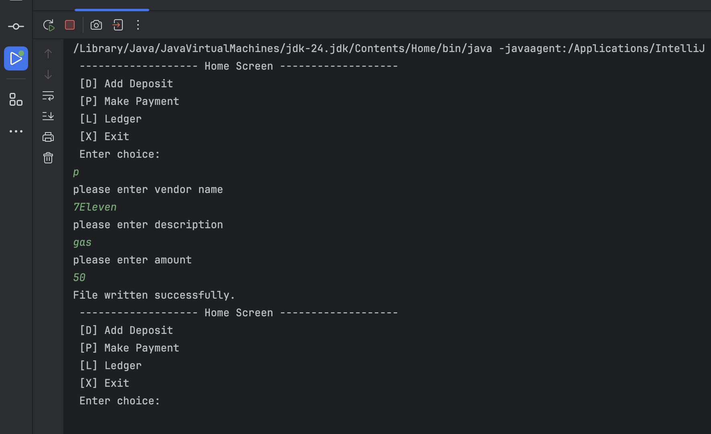
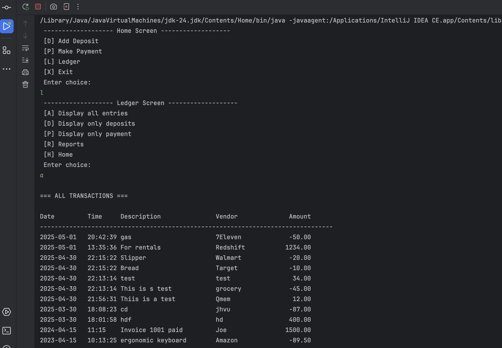
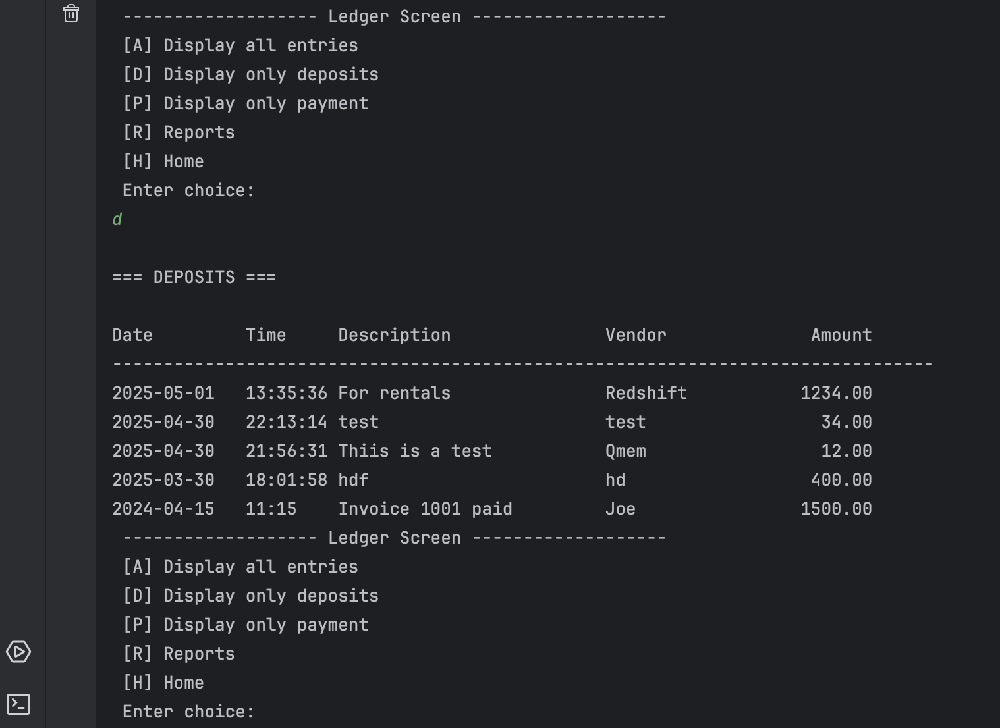
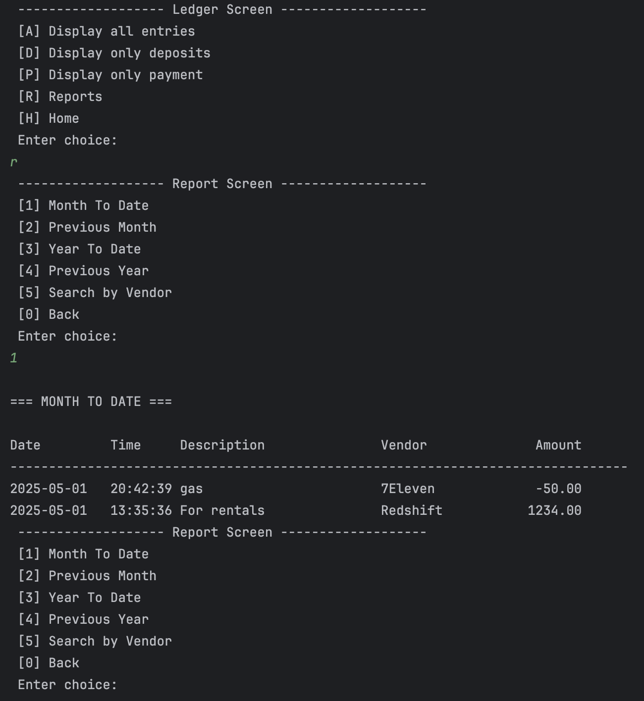
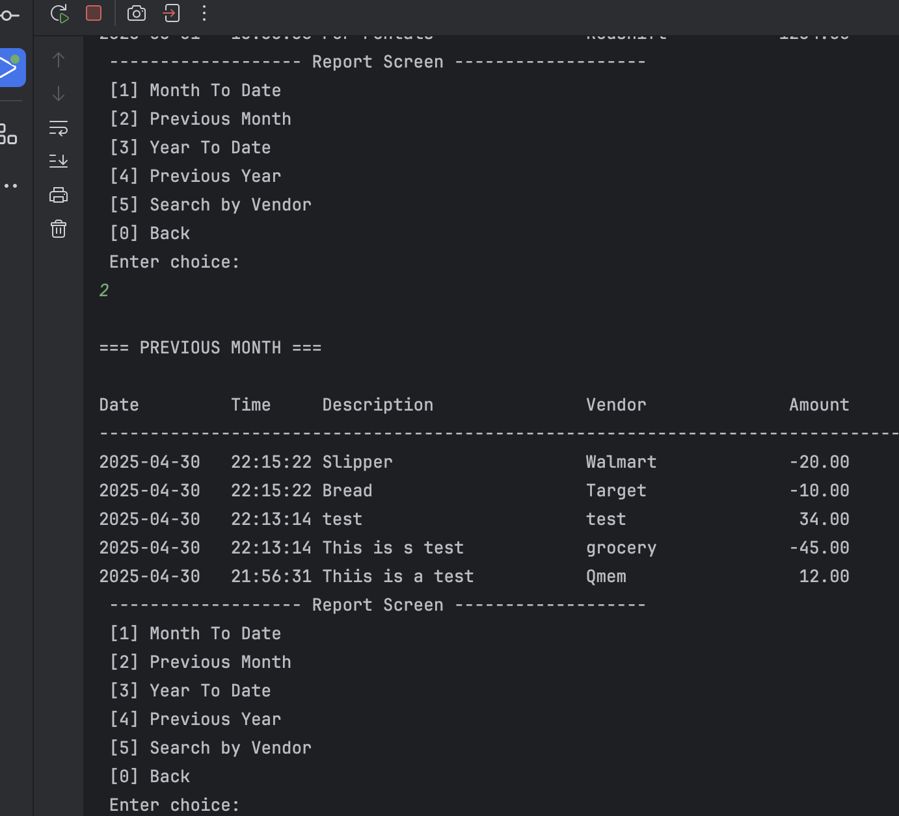
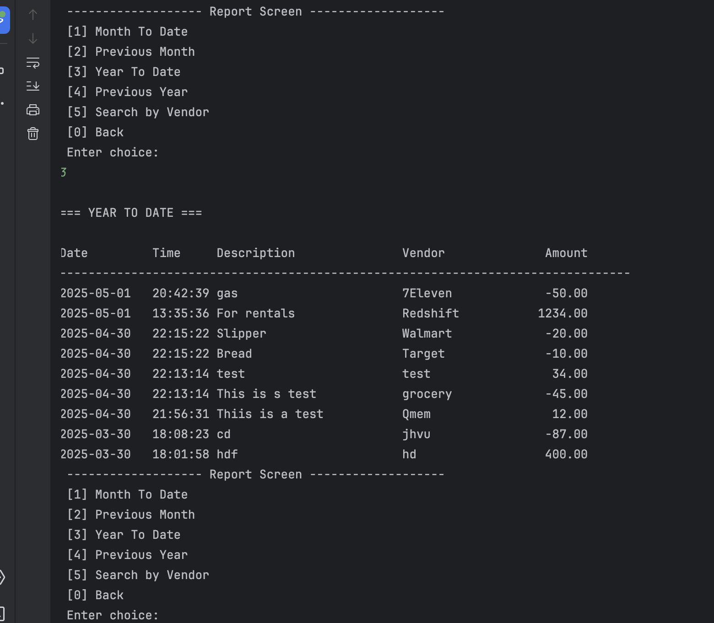
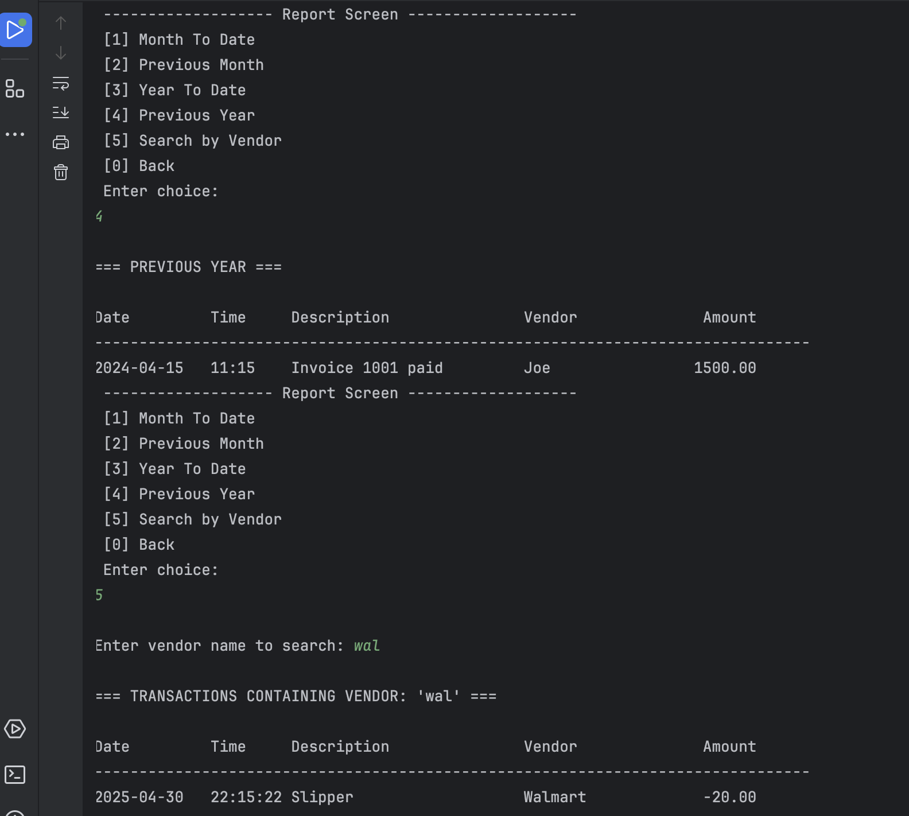
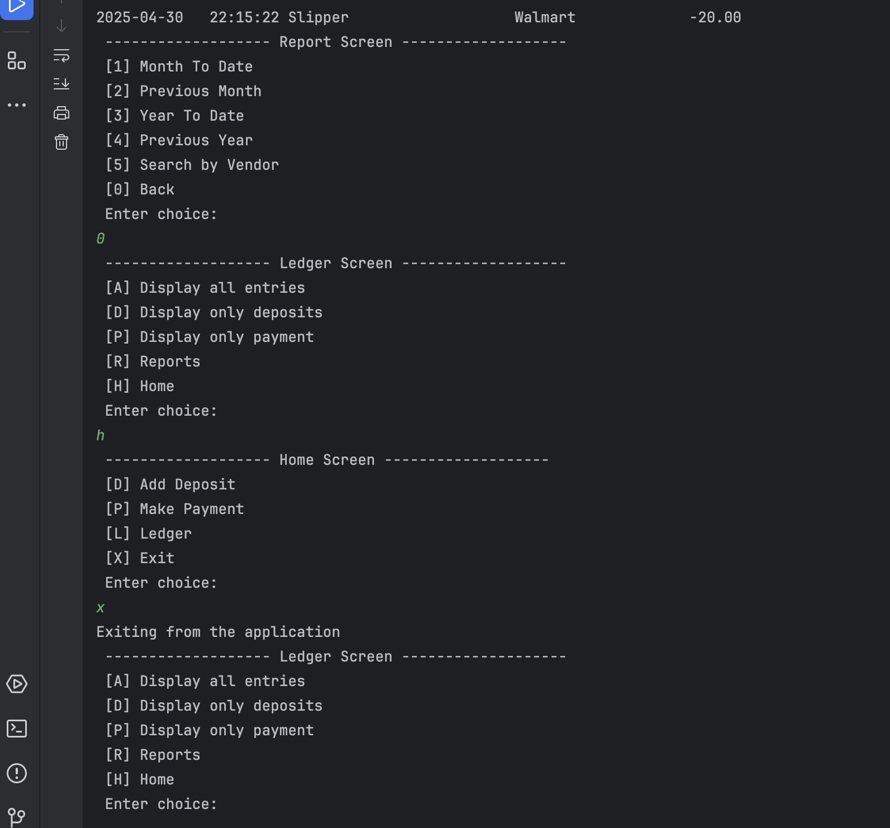

# Accounting-Ledger-Application
This is the main menu. You can choose to add a deposit, make a payment, view the ledger, or exit the app.
The Deposit lets you record money coming in. After you choose it, the app asks for the vendor name, description, and amount.
Once you enter those, it saves the deposit to your ledger.

After you enter the vendor, description, and amount, the app automatically adds the current date and time.
It saves everything in this format: date | time | description | vendor | amount.
Example: 2023-04-15 | 10:13:25 | ergonomic keyboard | Amazon | -89.50

Make Payment
This lets you record money going out, like bills or purchases.
It asks you to enter the vendor, description, and amount — then saves it as a payment.

Ledger Screen

This shows a list of all your transactions. You can see everything, or filter to only deposits or only payments.
It helps you quickly view where your money came in and where it went out.

Display All Entries

This shows all transactions — both deposits and payments — together in one list.
You can see the date, time, description, vendor, and amount for each transaction.

Display Only Deposits

This shows just the deposits — the money that came in.
It’s useful to check how much you’ve earned or received.

Reports Screen

Reports let you quickly view your transactions in different ways.
You can filter by time periods or search by vendor.

Month to Date

Shows all your transactions from the current month so far.
It helps you see what’s been happening this month.

Previous Month

Shows all your transactions from the last month.
Good for comparing how you did last month.

Year to Date

Shows everything from this year up to today.
It gives you an overview of your yearly activity.

Previous Year

Shows all your transactions from last year.
This is useful to compare year-over-year.

Search by Vendor

Lets you search transactions by vendor name.
For example, you can see everything spent at Walmart.

Exit

This closes the app.

